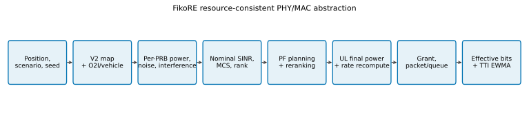
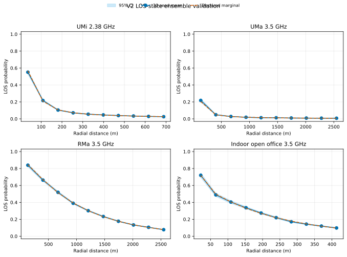
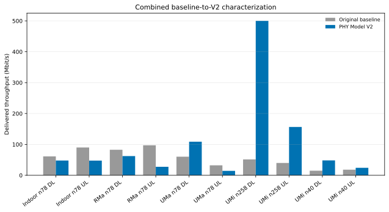
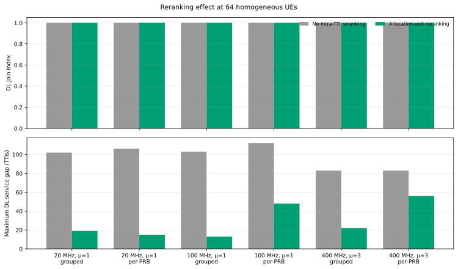
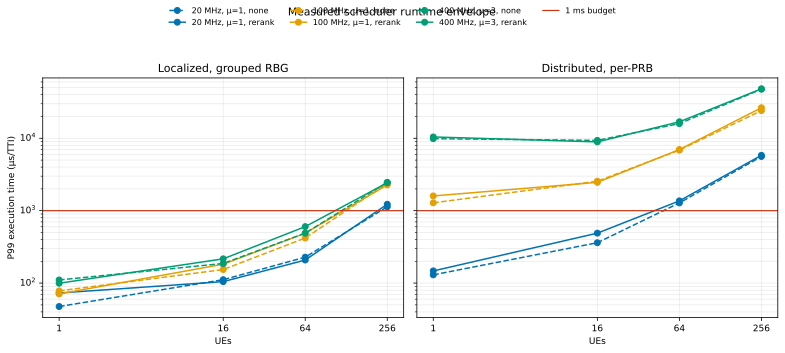

# A Reproducible Resource-Consistent PHY/MAC Abstraction for 5G Application Emulation

**Status:** External technical-review manuscript
**Model under test:** `feature/phy-model-v2`
**Model implementation source:** `1b55ca191e27a368936476fff33fc622833d8d13`
**Packet-profile source:** `1b55ca191e27a368936476fff33fc622833d8d13`
**Runtime-benchmark source:** `1b55ca191e27a368936476fff33fc622833d8d13`
**Evidence protocol:** `docs/phy-model-v2-evidence-protocol.md`
**Date:** 2026-09-28

## Abstract

FikoRE is a packet-carrying, single-cell 5G emulator whose 1 ms loop must
remain fast enough to expose real applications to coverage, capacity, delay,
loss, and scheduling effects. It therefore uses a system-level PHY/MAC
abstraction rather than waveform processing. We identify three classes of
internal inconsistency in the previous abstraction: mixed bandwidth references
in the link budget, uplink power reuse across independently scheduled grants,
and proportional-fair (PF) history coupled to CQI update cadence. We introduce
a per-PRB signal/noise reference, allocation-aware two-stage uplink power
finalization, and a TTI-updated PF state with optional intra-TTI reranking. We
also activate 21 deterministic spatial maps with explicit origin and
provenance, separate map loss from runtime penetration, and make physical UE
environment state explicit.

Validation combines unit invariants, byte reproduction, 630 independently
seeded map realizations, five 180 s packet-level profiles, a controlled O2I
stress pair, and repeated timing over 1–256 UEs. All promoted numeric map
arrays are byte-reproducible from their v2.1 metadata. Within the inscribed
map disks, the largest absolute bias of the 30-realization ensemble-mean
radial LOS probability is 0.038; the largest ensemble-mean axial
shadow-correlation error is 0.007, and the largest absolute ensemble-mean
opposite-edge correlation after padded generation is 0.026. Grouped PF
reranking materially reduces 64-UE maximum service gaps while long-run Jain
fairness is already near one, with sub-millisecond P99 cost on
the measured host, whereas distributed per-PRB 100/400 MHz grids exceed the
real-time budget. Windowed delivery metrics show that per-TTI zero grants need
not imply application-visible starvation, but UMa and RMa retain
multi-second delivery gaps whose queue/scheduler/radio causes are not
separable from current logs. These results establish internal
consistency and reproducibility, not predictive validity. Multicell
interference, beam state, carrier aggregation, calibrated MIMO, and
link-to-system error prediction remain open design decisions.

## 1. Contributions and claim boundary

This work makes four falsifiable contributions.

1. **Resource-consistent link accounting.** Desired signal, thermal noise,
   aggregate interference, uplink power, and grant capacity share a per-PRB
   reference. With stochastic fading disabled, equivalent grouping does not
   change estimated per-PRB SINR.
2. **Scheduler state with explicit temporal semantics.** PF achievable rate is
   refreshed by channel reporting, while service history is committed exactly
   once per active TTI using effective payload. Optional reranking uses only a
   provisional current-TTI denominator.
3. **Reproducible propagation inputs.** A 21-map catalog records generator
   version, seed, realization identity, coefficients, grid origin, and byte
   hash. The UE environment and penetration state are not hidden in the map.
4. **Controlled evidence.** Code, exact inputs, map bytes, summary data,
   confidence units, runtime samples, and figure generation are linked by a
   hash-verified manifest.

The work does **not** propose a new propagation model, prove 3GPP calibration,
validate the emulator against a held-out deployment, or claim a complete NR
PHY. The deliberately selected ABG path-loss family is preserved. Its external
validity, and that of the current MCS/BLER and MIMO abstractions, remains an
open calibration problem.

The original FikoRE publication positions the system as a modifiable RAN
emulator for application experimentation rather than a standards-calibration
simulator [21]. This work refines that existing architecture; its contribution
is audited resource/temporal semantics and reproducible evidence, not a new
general-purpose simulator. 5G-LENA and Simu5G provide broader system-level NR
models and calibration precedents [19], [20], while the Vienna methodology
demonstrates the missing link-to-system validation step [18].

## 2. Emulator scope and processing boundary

FikoRE executes one application-facing MAC step every
\(\Delta t=1\ \mathrm{ms}\). It carries generated or captured packets through
traffic, queue, scheduling, grant consumption, and delay-expiry logic. HARQ
timing/buffer scaffolding exists, but the compiled V2 branch disables the
BLER-driven retransmission decision. The physical abstraction supplies
resource-level rates; it does not synthesize IQ samples, reference signals,
decoding, or channel matrices.



The intended operating boundary is:

- one serving cell and one configured carrier;
- scenario-level large-scale gain with optional stochastic small-scale fading;
- resource-grid scheduling with selectable frequency/time aggregation;
- scalar antenna gains and threshold-based rank;
- actual packet queues and effective delivered payload;
- reproducible accelerated offline execution and configuration-dependent
  per-TTI timing measurements.

This boundary is narrower than 3GPP calibration simulators and wider than a
static link-budget calculator. In particular, packet demand can leave resources
unused even when radio capacity exists, and an allocated grant can carry less
effective payload because of packet size, queue state, or expiry.

## 3. Formal model

### 3.1 Grid and scheduling units

For numerology \(\mu\), subcarrier spacing is

\[
\Delta f = 15\cdot 2^\mu\ \mathrm{kHz}.
\]

Given usable RF bandwidth \(B_{\mathrm{RF}}\), the modeled PRB count is

\[
N_{\mathrm{RB,car}}
=\left\lfloor\frac{B_{\mathrm{RF}}}{12\Delta f}\right\rfloor.
\]

A frequency allocation unit contains \(n_b\) PRBs and therefore
\(N_{\mathrm{SC},b}=12n_b\) subcarriers. A localized time unit spans all
numerology slots in the 1 ms TTI; a distributed unit schedules each slot
separately. The decision count per direction is

\[
N_{\mathrm{dec}}
=N_{\mathrm{freq\ units}}N_{\mathrm{time\ units}}.
\]

The current grid uses configured usable-bandwidth approximations and does not
apply a standards-table PRB cap. Grouped scheduling uses only complete RBGs;
any remainder PRBs are not represented. Canonical profiles are tested
explicitly rather than inferred to cover every NR bandwidth/numerology pair.
Canonical evidence is TDD. V2 rejects asymmetric FDD because the current PHY
shares one direction-independent grid descriptor; symmetric 0.5/0.5 FDD
remains available.

For TDD, the configured pattern determines the usable symbols for each
direction. A DL-ineligible UL slot, an UL-ineligible DL slot, and configured
transition symbols are intentional duplexing structure, not unassigned
scheduler resources. Reported grid fill is therefore

\[
U_d=
\frac{N_{\mathrm{assigned},d}}
     {N_{\mathrm{available\ units},d}},
\]

where the denominator contains physically available units for direction \(d\);
per-TTI summaries record structurally unavailable, empty, assigned, and
effective-payload units separately.

### 3.2 Deterministic macroscopic gain

The map stores macroscopic **link gain**, not positive path loss. For
LOS state \(q\in\{\mathrm{L},\mathrm{N}\}\),

\[
PL_q(d,f)
=10\alpha_q\log_{10}\!\left(
\frac{\max(d,1\ \mathrm{m})}{1\ \mathrm{m}}\right)
+\beta_q
+10\gamma_q\log_{10}\!\left(\frac{f}{1\ \mathrm{GHz}}\right),
\]

and the corresponding map field is

\[
G_q(\mathbf{x})=S_q(\mathbf{x})-PL_q(d(\mathbf{x}),f)
\quad[\mathrm{dB}],
\]

where \(S_q\) is zero-mean correlated shadowing. The target shadow covariance
is the Gudmundson form, implemented through a 2D filtered-field approach [9],

\[
\rho_q(\Delta r)=\exp\!\left(-\frac{|\Delta r|}{d_{\mathrm{cor},q}}\right).
\]

V2.1 generates a correlated Gaussian field \(Z(\mathbf{x})\) by embedding the
target covariance in a grid twice as wide and cropping its center, transforms it to
\(U(\mathbf{x})=\Phi(Z(\mathbf{x}))\), and selects the binary LOS state

\[
L(\mathbf{x})
=\mathbb{1}\!\left[
U(\mathbf{x})\le p_{\mathrm{LOS}}(d(\mathbf{x}),h_{\mathrm{UT}})
\right].
\]

The final stored gain is

\[
G_{\mathrm{map}}(\mathbf{x})
=L(\mathbf{x})G_{\mathrm{L}}(\mathbf{x})
+(1-L(\mathbf{x}))G_{\mathrm{N}}(\mathbf{x}).
\]

The LOS marginal follows the retained scenario equations from TR 38.901
[1], including the corrected UMa dependence on UE height, except for the
shopping-mall profile, which is explicitly labelled as a legacy FikoRE
heuristic with pending provenance. UMa height is a fixed map-generation
parameter (1.5 m in the production catalog), not runtime per-UE state. This
does not make the complete map a TR 38.901 channel realization: path loss
remains the measurement-derived ABG family selected in the 2025 redesign.
The design rationale and coefficient lineage originate in the associated
thesis [6].

V2 uses an odd 291×291 grid. For cell spacing \(c\), runtime coordinates map to

\[
i_x=\frac{x}{c}+\frac{N-1}{2},\qquad
i_y=\frac{y}{c}+\frac{N-1}{2},
\]

followed by bilinear interpolation. Thus \((0,0)\) is one explicit center cell.
Binary LOS semantics apply at generated nodes; off-grid interpolation blends
already-selected dB gains and is therefore an effective-gain field, not a
categorical LOS decision. V1 files retain their historical origin rule when
explicitly selected.

### 3.3 Runtime penetration and additional loss

The canonical configuration surface is

```ini
ue_location_type: outdoor | indoor | vehicle | random
building_penetration: none | low_loss | high_loss
vehicle_penetration: standard | metallized
```

The feature-branch-only key `location` is rejected. The older integer `o2i`
key is retained solely as a pre-feature migration path.

Additional runtime loss is

\[
L_{\mathrm{add}}
=L_{\mathrm{wall}}+0.5d_{\mathrm{in}}
+a_{\mathrm{O_2}}(f)\frac{d}{1000}
\quad[\mathrm{dB}]
\]

for an indoor UE with an enabled facade profile. The low- and high-loss wall
terms use the material-mixture form

\[
L_{\mathrm{wall}}
=\max\!\left[
0,\,
5-10\log_{10}
\left(\sum_m p_m10^{-L_m(f)/10}\right)+X_\sigma
\right],
\]

with \(\sigma=4.4\ \mathrm{dB}\) and \(6.5\ \mathrm{dB}\), respectively,
and one deterministic UE-shared draw. Indoor depth, building loss, and vehicle
loss are shared by DL and UL. Separate keyed streams isolate environment,
fast-fading, interference, and distance-CQI draws. Indoor-scenario profiles in
which both endpoints are indoors set facade penetration to `none`; they do not
apply an outdoor wall a second time. Oxygen loss applies independently of UE
environment type.

For low loss, material weights are 0.3 standard glass and 0.7 concrete; for
high loss they are 0.7 IRR glass and 0.3 concrete, with
\(L_{\mathrm{glass}}=2+0.2f_{\mathrm{GHz}}\),
\(L_{\mathrm{IRR}}=23+0.3f_{\mathrm{GHz}}\), and
\(L_{\mathrm{concrete}}=5+4f_{\mathrm{GHz}}\) dB. A shared environment stream
pre-generates 100 candidates
\[
d_j=\min(U_{j,1},U_{j,2})D_{\max},
\]
where \(D_{\max}=25\) m for UMi/UMa and 10 m for RMa. At first channel
evaluation, the first \(d_j<d\) is selected (or the final candidate is clipped
to \(d\)) and each direction freezes that same result. Explicit
`outdoor|indoor|vehicle` states are preserved in every scenario; only
`random` applies scenario probabilities.

Vehicle loss is separate:

\[
L_{\mathrm{vehicle}}
=\max(0,\mu_v+5Z)\ \mathrm{dB},
\]

with \(\mu_v=9\ \mathrm{dB}\) for standard glazing and
\(20\ \mathrm{dB}\) for metallized glazing. Vehicle UEs do not receive the
building indoor-depth term.

### 3.4 Per-resource power, noise, and SINR

Downlink total carrier power \(P_{\mathrm{DL,tot}}\) is spread uniformly over
carrier PRBs:

\[
P_{\mathrm{DL,PRB}}
=P_{\mathrm{DL,tot}}-10\log_{10}N_{\mathrm{RB,car}}
\quad[\mathrm{dBm}].
\]

Thermal noise is referenced to the same PRB:

\[
P_{N,\mathrm{PRB}}
=N_0+NF+10\log_{10}(12\Delta f)
\quad[\mathrm{dBm}],
\]

where canonical profiles use \(N_0=-174\ \mathrm{dBm/Hz}\).

For fractional uplink control, the nominal per-PRB power is

\[
P_{\mathrm{nom,PRB}}
=P_0+\alpha PL_{\mathrm{pc}}(\max[d-d_{\mathrm{in}},1\ \mathrm{m}]),
\]

and for \(M_i\) granted PRBs,

\[
\begin{aligned}
P_{i,\mathrm{tot}}
&=\operatorname{clip}\!\left(
P_{\mathrm{nom,PRB}}+10\log_{10}M_i,
P_{\min},P_{\max}\right),\\
P_{i,\mathrm{PRB}}
&=P_{i,\mathrm{tot}}-10\log_{10}M_i.
\end{aligned}
\]

This is a deliberately reduced form of the PUSCH power-control structure in
TS 38.213 [3].

The present implementation uses \(P_{\min}=10\ \mathrm{dBm}\) and
\(P_{\max}=23\ \mathrm{dBm}\); fixed-power mode treats the configured value as
total UE power. \(PL_{\mathrm{pc}}\) is the LOS ABG control-path estimate, not
the complete map/O2I realization. Both choices must remain visible because the
10 dBm floor and control-path simplification are not universal NR behavior.

The scheduler first evaluates UL candidates using nominal power corrected by
the most recently finalized allocation when power-limited. There is one such
state per UE: in localized mode it comes from the previous TTI, while later
distributed time groups inherit the preceding group's state. After all
assignments in the current time group are known, the emulator recomputes
\(P_{i,\mathrm{PRB}}\), SINR, MCS, and grant bits. It does not reschedule.
This prevents each independently considered grant from reusing the complete
23 dBm budget, but remains an order-dependent heuristic rather than a joint
power/scheduling optimum.

Let \(I_{\mathrm{PRB}}\) be configured aggregate co-channel interference in
linear power, \(F_b\) a small-scale term, \(v_i\) the selected rank, and
\(\Delta_i\) a configured SINR offset. Resource-level SINR is

\[
P_{N+I,\mathrm{PRB,dBm}}
=10\log_{10}\!\left(
1000\,[P_{N,\mathrm{PRB,W}}+P_{I,\mathrm{PRB,W}}]
\right),
\]

\[
\Gamma_{i,b}
=P_{i,\mathrm{PRB}}+G_{\mathrm{tx}}+G_{\mathrm{rx}}
+G_{\mathrm{map}}(\mathbf{x}_i)-L_{\mathrm{add},i}
+F_{i,b}
-10\log_{10}v_i
-P_{N+I,\mathrm{PRB,dBm}}
+\Delta_i.
\]

All remaining additive terms are in dB/dBm as appropriate.
Current interference is an aggregate per-PRB PSD approximation using a
configured interferer count, overlap ratio, random power, distance offset, and
LOS ABG loss. It has no neighbor geometry, load, beam, or scheduler state.
The UL surrogate samples \([-23,+23]\) dBm on the per-PRB reference and omits
interferer antenna gain and penetration; it must not be interpreted as a
total-power UE model or calibrated received interference.

When enabled, small-scale power gain is

\[
F_{i,b}=10\log_{10}\!\left(\frac{X^2+Y^2}{2}\right),
\qquad X,Y\sim\mathcal N(0,1),
\]

which has unit mean in linear power. Independent keyed streams are used by
direction. The implementation applies Rayleigh fading to both LOS and NLOS and
holds/redraws it on coherence blocks expressed in scheduling units; changing
grouping can therefore change stochastic sample resolution even though the
deterministic PSD/SINR reference is invariant.

### 3.5 MCS, rank, and grant bits

With table mode enabled, MCS is

\[
m_{i,b}
=\max\{m:\Gamma_{i,b}\ge\theta_{m,n_b,\ell_{\mathrm{cfg}}}\},
\]

where thresholds depend on table, allocation-size class, and configured layer
count. The zero-based table axis is derived from the one-based layer count; an
off-by-one defect found during adversarial review was corrected and bounded for
one through four layers. If \(\Gamma_{i,b}<\theta_0\), FikoRE returns \(m=-1\),
sets spectral efficiency to zero, and the UE is not a positive-rate candidate
on that unit. This is an MCS-table boundary, not a separate configured
minimum-SINR admission rule.
NR MCS, code-rate, layer, and TBS semantics are defined in TS 38.214 [4];
FikoRE's threshold/grant abstraction is not a full implementation of that
procedure.

For spectral efficiency \(\eta_m\), allocation subcarriers
\(N_{\mathrm{SC},b}\), usable symbols \(N_{\mathrm{sym},b}\), rank \(v_i\),
overhead \(o(f,d)\), and scaling \(s_i\), nominal grant bits are

\[
B_{i,b}
=v_iN_{\mathrm{SC},b}N_{\mathrm{sym},b}
\eta_m(1-o)s_i.
\]

This is a capacity proxy with fixed frequency/direction overhead. It does not
perform NR TBS rounding, CRC/code-block segmentation, rate matching, DMRS or
codeword mapping.

The current rank abstraction is threshold-based in mean SINR, capped by UE
antenna count and configured layer count; UL rank is one. The selected MCS
threshold family remains tied to configured layers rather than dynamically
changing rank. The model neither represents a channel matrix nor predicts
post-processing layer SINR. Packet/queue handling maps nominal grant bits
\(B_{i,b}\) to effective payload \(B^{\mathrm{eff}}_{i,b}\le B_{i,b}\) for
new transmissions. Reported error throughput is queue/expiry accounting, not a
calibrated radio-BLER outcome. The disabled HARQ retry path is excluded from
the evidence and requires a grant-cap invariant and actual grant-rank/RBG
context before re-enablement; its current initialization uses UE antenna count,
not selected rank.

For rank above one, rank selection also observes SINR after the previous
rank's equal-power penalty, without hysteresis; oscillation is possible.
Canonical evidence is rank one and does not validate this behavior.

### 3.6 Proportional-fair state and reranking

The implemented PF metric is

\[
M_{i,b}(t)
=\frac{w_i r_{i,b}(t)^\alpha}
       {\max(\bar R_i(t),\epsilon)},
\]

The rate-over-history structure follows proportional-fair utility and
stochastic scheduling foundations [10], [11].

where \(w_i\) is UE priority, \(r_{i,b}\) is current achievable nominal rate,
and \(\alpha\) is cell-wide. Per-UE PF exponents are rejected.

Service history is committed once per active 1 ms TTI:

\[
\begin{aligned}
a&=1-\exp(-1/\tau_{\mathrm{ms}}),\\
\bar R_i(t+1)
&=(1-a)\bar R_i(t)+a\,x_i(t),
\end{aligned}
\]

where \(x_i(t)\) is effective payload served in the TTI. An active,
positive-rate, backlogged UE that receives no payload contributes zero. An
idle UE freezes state. Detach resets state, and cold start uses the standalone
achievable rate rather than epsilon. CQI cadence changes \(r_{i,b}\); it does
not gate the EWMA update.

In `allocation_unit` mode, after each planned grant the scheduler projects

\[
\tilde R_i(t,b)
=(1-a)\bar R_i(t)+a\,x^{\mathrm{nom}}_i(t,b)
\]

using cumulative nominal bits already planned in the current TTI, then reranks
the next unit. The committed EWMA still updates once, using effective payload.
For UL, all units are planned and provisionally reranked before final
allocation-aware power is known; the final power correction does not trigger a
second scheduling pass. Exact metric ties use a persistent round-robin cursor.

## 4. Accepted corrections

| Defect | Accepted correction | Verification |
|---|---|---|
| Invalid or ambiguous reference carriers | n40 20 MHz/30 kHz; UMa and RMa n78 100 MHz/30 kHz; n258 400 MHz/120 kHz; explicit power/gain/NF profiles | Profile parser/grid tests |
| One-PRB noise combined with grouped signal/capacity | Physical carrier PRBs separated from scheduling units; per-PRB signal, noise, and interference reference | Unit sweep plus grouped/per-PRB runtime SINR invariant |
| UL total power reused by independently considered grants | Nominal planning plus allocation-aware total-power finalization | 1–275 PRB power conservation and 23 dBm cap |
| PF exponent and history embedded in per-UE/CQI behavior | Common \(\alpha\); 1 ms EWMA of effective service; fair ties | State, metric, migration, homogeneous-scheduler tests |
| Same-TTI repeated winners in grouped grids | Configurable provisional allocation-unit reranking | Fairness/gap/runtime benchmark |
| One-based layer count used as zero-based table index | Bounded `layers - 1` conversion at PHY and disabled-HARQ call sites; bounded RI threshold loop | Layer/rank index regression test |
| Unseeded, origin-ambiguous production maps | 21 deterministic v2 files, odd grid, binary LOS, manifest, exact n40 map | Two-catalog byte equality; origin test; 630-realization study |
| O2I overloaded into one integer/map assumption | Explicit UE environment, building, and vehicle fields; indoor-gNB profiles omit facade loss | Unit formulas and controlled high-loss n258 pair |

## 5. Experimental method and artifacts

The protocol was fixed before final profile analysis
(`docs/phy-model-v2-evidence-protocol.md`). The validation host was `pitahaya`,
an AMD Ryzen 7 5800H with 8 cores/16 threads, Linux 5.15.0-58, g++ 11.4.0,
Python 3.10.4, and NumPy 2.2.6.

### 5.1 Map ensemble

Thirty independent master seeds (`20270000`–`20270029`) generated every one of
the 21 scenario-frequency entries: 630 maps total. Confidence intervals use
the realization as the independent unit; spatial cells are never counted as
replicates. Reported quantities are radial LOS probability, link-gain
quantiles, shadow moments, and axial correlation at the nearest
grid-representable physical lag. Per-realization shadow standard deviation is
normalized by construction and is therefore a generator sanity check, not
independent validation.

### 5.2 Packet-level profiles

Five profiles ran for 180 simulated seconds with seed `20260927`; analysis
excluded the first 20 seconds:

- UMi n40 NPN, 11 UEs;
- UMa n78 pedestrian, 21 UEs;
- RMa n78 vehicular, 11 UEs;
- indoor open-office n78, 11 UEs;
- outdoor UMi n258 FWA, 11 UEs.

An additional n258 pair changed only
`outdoor + no penetration` to `indoor + high-loss penetration`.

An outage UE has MCS below zero in at least 99% of post-warm-up radio samples.
Starvation is not inferred from a zero-grant TTI. For non-outage UEs, the
analysis uses non-overlapping 10 ms, 100 ms, and 1 s zero-delivery windows and
each UE's maximum observed delivery gap inside contiguous positive-offer
segments. Queue backlog is not logged, so these are application-delivery—not
scheduler-starvation—metrics.

The `Errors` field in committed summaries counts queue/expiry fate recorded by
the packet layer. It is not radio BLER because the V2 HARQ/BLER decision is
disabled.

### 5.3 Runtime

The PF envelope uses one process/thread, disabled verbose logging, 20 warm-up
TTIs, 100 individually measured TTIs, and ten process repetitions per case
(1,000 TTI timings). A separate functional run uses 500 warm-up and 2,000
measured TTIs at 64 UEs.
Populations are 1, 16, 64, and 256 UEs. The low-resolution case is localized
grouped RBG; the high-resolution case is distributed per-PRB. Aggregate
offered traffic is approximately 4 Gbit/s per direction, divided over UEs.
This bounded full-backlog input replaces an invalid 100 Gbit/s-per-UE stress
configuration that measured queue growth rather than scheduler cost.

The complete matrix, commands, and limitations are in
`docs/baselines/phy-v2-validation-matrix.md`. Hashes are verified by
`tools/verify_phy_v2_evidence.py`; figures are regenerated by
`tools/generate_phy_v2_figures.py`.

## 6. Results

### 6.1 Map activation and ensemble behavior

Two independent v2.1 production generations were byte-identical. V2.1 changes
the v2.0 arrays because padded embedding removes periodic edge seams; it
preserves the approved coefficients, dimensions, frequencies, and master-seed
policy. A same-code, same-seed legacy-v1/v2.1 profile pair isolates the catalog
change for one realization.

Across 630 maps:

- largest absolute bias of the 30-realization ensemble-mean radial LOS
  probability within each map's inscribed disk was 0.038;
- largest absolute error of the ensemble-mean axial correlation at the sampled
  physical lag was 0.007;
- largest absolute ensemble-mean opposite-edge correlation was 0.026;
- normalized shadow standard deviations equaled their configured values;
- exact-frequency UMi 2.38 GHz lookup replaced nearest 3.5 GHz lookup.

Exact scenario-frequency lookup is now the default. Nearest fallback requires
`allow_nearest_map_fallback: true` and logs both frequencies.



The map-only 0 dB full-channel-SNR proxy was 100.0% for UMi 2.38 GHz, 98.5%
for gain-assisted UMi 26 GHz, 78.5% for RMa 3.5 GHz, 38.2% for UMa 3.5 GHz,
and 26.4% for indoor open-office 3.5 GHz. These fractions cover the complete
generated square, including distances that are not representative indoor
layouts and may exceed source-fit ranges. They expose a geometry/range
limitation; they are not coverage predictions.

### 6.2 Five packet-level profiles

| Profile | Dir. | Offered | Delivered | Outage UEs | Zero-delivery 1 s | Maximum UE delivery gap | Grid assigned/effective | Payload/grant |
|---|---|---:|---:|---:|---:|---:|---:|---:|
| Indoor n78 | DL | 65.00 | 42.54 | 0 | 0.0% | 0.81 s | 86.7% / 86.7% | 21.4% |
| Indoor n78 | UL | 90.00 | 60.35 | 0 | 0.0% | 0.09 s | 100.0% / 60.8% | 46.5% |
| RMa n78 | DL | 120.01 | 51.82 | 0 | 18.6% | 102.09 s | 96.0% / 96.0% | 98.7% |
| RMa n78 | UL | 120.01 | 26.28 | 0 | 3.2% | 5.10 s | 99.9% / 57.3% | 85.0% |
| UMa n78 | DL | 180.01 | 103.80 | 2 | 10.4% | 76.76 s | 99.0% / 99.0% | 73.5% |
| UMa n78 | UL | 70.00 | 13.37 | 0 | 28.2% | 160.00 s | 100.0% / 17.8% | 100.0% |
| UMi n258 | DL | 500.02 | 500.02 | 0 | 0.0% | 0.00 s | 99.5% / 99.5% | 39.5% |
| UMi n258 | UL | 200.01 | 157.05 | 0 | 0.0% | 0.02 s | 100.0% / 28.8% | 22.1% |
| UMi n40 | DL | 50.00 | 46.55 | 0 | 0.0% | 0.07 s | 100.0% / 100.0% | 71.9% |
| UMi n40 | UL | 35.00 | 24.29 | 0 | 0.0% | 0.03 s | 100.0% / 83.8% | 76.5% |

Rates are Mbit/s.

Three conclusions follow.

First, a zero grant in an individual TTI is normal. UMi n40 has many 10 ms
zero-delivery windows (10.1% DL and 31.8% UL), yet no 1 s zero-delivery windows
and maximum observed gaps of 70 ms DL and 30 ms UL. Labeling every zero TTI as
application-visible starvation substantially over-reports the problem.

Second, some long application-delivery gaps are observed. UMa has a high
assignment ratio while individual non-outage UEs show gaps up to 160 s.
RMa has low-MCS periods and substantial zero-delivery 1 s windows. These
observations combine source state, queueing, scheduling, expiry, and radio
state. They require
backlog/eligibility/reason instrumentation and multiple seeds before causal
classification.

Third, fill below 100% does not imply structural TDD loss. Per-TTI summaries
separate directionally unavailable units before the utilization denominator.
RMa assigns 96.0% of available DL and 99.9% of available UL units, but only
57.3% of UL units carry positive effective payload. UMa UL similarly assigns
100.0% while only 17.8% carry effective payload. The original plots therefore
mixed TDD-unavailable, empty, assigned, and useful units. Queue reservation and
explicit empty/waste reasons remain required.

For historical context only, the original baseline and V2 run differ in seed,
code, profiles, PF, PHY, and maps. The figure is deliberately unpaired and
must not be interpreted as an effect estimate:



The controlled catalog result is the one-factor legacy-v1/v2.1 pair: RMa DL
rises 14.1%, while UMa DL falls 8.5%, indoor DL falls 2.0%, and n40 DL falls
2.5% for the fixed seed; n258 DL remains demand-saturated.

With common keyed fading/interference streams, the controlled high-loss n258
pair reduced median-UE SINR by 38.15 dB DL and 38.71 dB UL. Throughput fell
53.0% DL and 64.8% UL. This one-seed ablation isolates configured environment
loss; the maximum per-UE standard deviation of the paired DL SINR delta was
below \(6.2\times10^{-6}\) dB. Equivalent gains remain an alignment abstraction, not
beamforming.

### 6.3 PF reranking, fairness, and runtime

At 64 homogeneous UEs, allocation-unit reranking improves grouped-grid
fairness and continuity consistently:

| Grid | Unit | Jain none → rerank | Maximum DL effective-service gap none → rerank | P99 runtime none → rerank |
|---|---|---:|---:|---:|
| 20 MHz, \(\mu=1\) | grouped | 0.9990 → 0.9999 | 96 → 18 TTIs | 188 → 192 µs |
| 100 MHz, \(\mu=1\) | grouped | 0.9990 → 1.0000 | 96 → 6 TTIs | 364 → 377 µs |
| 400 MHz, \(\mu=3\) | grouped | 0.9994 → 1.0000 | 81 → 6 TTIs | 333 → 379 µs |
| 20 MHz, \(\mu=1\) | per-PRB | 0.9990 → 1.0000 | 96 → 2 TTIs | 989 → 1050 µs |
| 100 MHz, \(\mu=1\) | per-PRB | 0.9990 → 1.0000 | 96 → 1 TTI | 5454 → 5778 µs |
| 400 MHz, \(\mu=3\) | per-PRB | 0.9997 → 1.0000 | 83 → 0 TTIs | 12362 → 13021 µs |



The functional columns use 500 warm-up plus 2,000 measured TTIs; timing uses
ten runs of 100 individually timed TTIs after 20 warm-up TTIs. Long-run Jain
fairness converges near one in both modes, while reranking materially reduces
maximum MAC effective-service gaps, especially in grouped grids. Canonical grouped-RBG PF
profiles therefore opt into reranking; the global default remains `none` for
high-resolution per-PRB experiments.

Runtime is a property of the complete grid/population, not only reranking:



On the measured, non-isolated host, grouped modes have zero observed 1 ms
compute-budget exceedances through 64 UEs for every tested bandwidth. At
256 UEs, exceedance fractions are 0.0% at 20 MHz, 17.2–21.3% at 100 MHz,
and 20.4–22.5% at 400 MHz. Distributed per-PRB 20 MHz first exceeds the budget at
64 UEs; 100 MHz has no exceedance at one UE and 86.1–93.4% at
16 UEs, while every 400 MHz TTI exceeds it. At 256 UEs, per-PRB P99 reaches
19.94 ms for 100 MHz and 41.84 ms for 400 MHz.
These are empirical host/case measurements, not a general real-time guarantee.

## 7. External validity and parameter realism

### 7.1 Carrier, power, gain, and noise assumptions

| Profile | Carrier | Total DL power | Scalar gains gNB/UE | NF gNB/UE |
|---|---|---:|---:|---:|
| UMi n40 | 2.38 GHz, 20 MHz | 43 dBm | 8.7/0 dBi | 2/9 dB |
| UMa n78 | 3.5 GHz, 100 MHz | 46 dBm | 8.7/0 dBi | 2/9 dB |
| RMa n78 | 3.5 GHz, 100 MHz | 46 dBm | 8.7/0 dBi | 2/9 dB |
| Indoor n78 | 3.5 GHz, 100 MHz | 24 dBm | 8.7/0 dBi | 2/9 dB |
| UMi n258 FWA | 26 GHz, 400 MHz | 35 dBm | 24/26 dBi | 7/10 dB |

The carrier widths and numerologies are valid single-carrier configurations
under TS 38.104 [2]. The powers are plausible classes of total-carrier values,
and the noise figures are plausible receiver abstractions, but they are not a
calibrated equipment table. In particular:

- the meaning of conducted power, TRP, and EIRP must remain explicit;
- 8.7 dBi is lower than many macro-sector antenna gains, while 43/46 dBm may
  already be interpreted differently by users;
- 24/26 dBi n258 gains are equivalent aligned FWA gains, not beamforming;
- the 10 dBm UL minimum and LOS-only power-control path loss are simplifications;
- receiver implementation loss is represented only through scalar NF and the
  MCS threshold data.

All canonical UE classes use fixed UL total-power mode. Study UEs use 23 dBm;
RMa, UMa, and n40 background UEs also use 23 dBm, while indoor and n258
background UEs use 10 dBm. Fractional \(P_0+\alpha PL\) control has algebraic
and UE-level finalization tests but no packet-level campaign in this evidence
set. \(P_0\), numerology normalization, closed-loop terms, and the
conducted/TRP/EIRP reference must be defined before using that mode for
external claims.

Thermal density \(-174\ \mathrm{dBm/Hz}\) is physically conventional. The
important correction is integrating it over the resource bandwidth rather
than replacing it with a fixed full-channel number.

### 7.2 Propagation and link adaptation

The ABG family was an explicit product decision based on the prior thesis and
published measurement fits. It is not automatically more valid than TR 38.901.
Sun *et al.* show that ABG parameters can be less stable than CI/CIF under
frequency/distance extrapolation [7], and the RMa literature specifically
warns about model range and height assumptions [8]. The current coefficient
values should therefore be accompanied by source campaign, fitted range,
height range, and extrapolation warnings before predictive coverage claims.

The 30-seed test validates generator behavior against its declared equations.
It does not validate those equations against a physical site. The wide indoor
map extent and low full-map coverage proxy reinforce the need for an approved
indoor geometry/range contract. Production corner distances are approximately
1.03 km for UMi/shopping-mall, 0.62 km for office maps, and 3.79 km for
UMa/RMa; these extents are storage geometry, not source-fit validity. Mobility
now warns when its requested radius exceeds the map corner. UMa maps also
encode one 1.5 m UE-height class; runtime UE height does not regenerate LOS
state.

Current MCS thresholds have no committed link-level dataset, decoder
assumption, BLER target provenance, or held-out calibration. Current rank is a
scalar SINR threshold. Consequently, MCS, outage, and throughput are internally
reproducible but not yet externally calibrated NR predictions. Link-to-system
methodology requires per-MCS calibration and validation, as demonstrated by
EESM/MIESM work [15].

## 8. Open Phase 3 design space

No Phase 3 option is approved by this manuscript.

| Topic | Minimum useful option | Higher-fidelity option | State and cost | Required calibration |
|---|---|---|---|---|
| Multicell interference | Load-coupled per-resource interferer activity with explicit neighbor geometry | Wraparound multicell scheduler/channel realization | Minimum adds cell load state and a fixed point; full option multiplies scheduler work | 3GPP calibration layouts, load curves, RSRP/SINR joint distributions |
| Beamforming | Discrete serving/interfering beam states, aligned gain, sidelobe gain, misalignment/blockage loss, update cadence | 2D/3D array patterns and channel-aware beam selection | Discrete state is compatible with application emulation; full arrays require angle/channel state | Beam-sweep overhead, gain distributions, blockage and tracking traces |
| Carrier aggregation | One UE MAC/RLC queue/LCP context with per-serving-cell grid, BWP, CQI/MCS, HARQ/grant state, and joint UL power constraint | PCell/SCell activation and cross-carrier scheduling/control overhead | Cannot be represented credibly by one wider carrier or independent per-CC queues | UE band combinations, simultaneous-UL power, scheduler traces, guard/control overhead |
| MIMO | Direction-specific rank state and calibrated per-rank post-processing-SINR/BLER tables | Correlated channel matrices, precoding, codewords, receiver model | Table option is moderate; matrix option changes abstraction class | RI/rank distributions, antenna correlation, codebook/receiver and layer BLER |
| Link abstraction | Provenanced AWGN BLER curves plus explicit target and OLLA | EESM/MIESM across PRBs, HARQ mutual-information accumulation | Curves are the prerequisite; ESM adds per-codeword aggregation and calibration | Link-level traces per MCS/rank/receiver/channel; independent validation |

### 8.1 Multicell interference

The current aggregate random interferer can raise or lower SINR but cannot
represent the feedback loop

\[
\rho_c
=\sum_{u\in c}
\frac{d_u}
{W\log_2(1+\mathrm{SINR}_u(\boldsymbol{\rho}))},
\]

in which neighbor load controls resource overlap and interference. A
load-coupled model [12] is the lightest candidate that separates RSRP from
traffic-dependent SINR. The external reviewer should decide whether explicit
three-sector/hexagonal geometry is required or whether scenario-calibrated
neighbor gains are sufficient.

### 8.2 Beam state

Scalar FWA gain closes the link budget but omits beam search, alignment,
sidelobes, blockage, and tracking. A discrete state model should precede full
arrays. Its link term should have explicit dB semantics, for example

\[
G_{\mathrm{beam}}(t)
=G_{\mathrm{tx}}(b_{\mathrm{tx}})
+G_{\mathrm{rx}}(b_{\mathrm{rx}})
-L_{\mathrm{align}}(a_t)-L_{\mathrm{block}}(z_t),
\]

where Tx/Rx beam IDs, alignment state \(a_t\), and blockage state \(z_t\) are
separate rather than mutually exclusive labels. Transitions can be tied to
mobility and measurement/report cadence, with explicit sweep resources,
reporting delay, beam-failure detection, and recovery. This captures
application-visible outages and latency without synthesizing a spatial
channel. Giordani *et al.* [13] provide the relevant taxonomy.

### 8.3 Carrier aggregation

CA must not be emulated by setting one invalid channel bandwidth. One UE MAC
entity retains shared logical-channel/RLC queues and logical-channel
prioritization, while each serving cell needs its own frequency, BWP,
numerology, grid, map/channel state, CQI/MCS, HARQ, and grant state. Simultaneous
UL carriers share a joint \(P_{\mathrm{CMAX}}\) constraint rather than
multiplying UE power. UE support is constrained by band combinations and
per-CC features [5]. PCell/SCell activation, shared MAC behavior, and optional
cross-carrier scheduling add control state [14], [22]–[24].

### 8.4 MIMO and link abstraction

A practical next MIMO model could expose

\[
(v,\Gamma_{\ell,k,\mathrm{cw}},n_{\mathrm{cw}},m_{\mathrm{cw}},
P_{\ell,k})
\]

from calibrated lookup distributions conditioned on scenario, SINR, and
antenna configuration. This would separate antenna count from rank and avoid
multiplying one scalar efficiency by rank without layer-quality evidence.

Before EESM/MIESM, FikoRE needs reproducible AWGN BLER curves. Given per-PRB
SINR \(\gamma_k\), EESM would use

\[
\gamma_{\mathrm{eff}}
=-\beta_m\ln\!\left(
\frac{1}{K}\sum_{k=1}^{K}e^{-\gamma_k/\beta_m}
\right),
\]

where \(\beta_m\) is calibrated per MCS. MIESM replaces the exponential
mapping with modulation-specific mutual information and is better suited to
rank/HARQ extensions; recursive EESM is one documented HARQ alternative [16].
OLLA can then update a scheduling offset from ACK/NACK
feedback toward a declared BLER target [17]. Adding any of these without a
link-level calibration set would increase complexity without increasing known
validity.

In this equation \(\gamma_k\) and \(\beta_m\) are linear, dimensionless SINR
quantities; aggregation should weight coded data REs rather than all PRBs
equally. Calibration classes must identify TBS, rank, receiver, codeword, and
HARQ redundancy version. OLLA also requires a separate bounded link-adaptation
offset; the current generic `sinr_offset_db`, which shifts both scheduler and
reported decoder SINR, is not an acceptable OLLA state.

## 9. Threats to validity

1. Five-profile outcomes use one traffic/mobility seed. They characterize
   deterministic cases but do not provide confidence intervals over user
   placement or traffic.
2. Thirty map realizations test the generator, not ABG field accuracy. Shadow
   variance is normalized by construction; confidence intervals are pointwise
   and no simultaneous model-equivalence claim is made.
3. Delivery is sampled every 10 ms; shorter delivery gaps are not observable.
   Initial/final zero-delivery runs are observed lower bounds under censoring,
   and queue backlog is unavailable.
4. Outage is a sampled MCS classification, not a BLER or admission-control
   event; changing warm-up or observation duration can change classification.
5. PF functional results use 2,000 TTIs after 500 warm-up TTIs, sufficient for
   the configured 100 ms EWMA to settle in this homogeneous case but not a
   proof of stochastic-approximation convergence.
6. Runtime P95/P99 use 1,000 individually timed TTIs from ten processes per
   case. Samples within one process are correlated, and the host was not
   CPU-isolated; empirical tails are not deployment guarantees.
7. Timing includes the measured emulator loop but excludes process/UE
   construction. Results apply only to the named host and bounded benchmark
   traffic.
8. Equivalent scalar gains remain an alignment abstraction; the controlled
   high-loss pair is one seed and not a beam/blockage distribution.
9. Interference, MIMO, and MCS/BLER lack a common held-out calibration oracle.
   BLER-driven HARQ is disabled. These omissions can dominate field throughput.

## 10. Recommendations

1. Release the accepted core and v2 map catalog with the exact evidence
   manifest and keep grouped allocation-unit reranking profile-specific.
2. Expose empty-grid reasons directly: no backlog, no positive-rate candidate,
   disabled UE, or packet-layer limitation. Do not infer them from TDD plots.
3. Add multi-seed packet-level campaigns and backlog/eligibility/reason logs
   before treating long delivery gaps as starvation distributions.
4. Complete the ABG coefficient provenance/range table and validate selected
   scenarios against independent RSRP/SINR measurements.
5. Establish a link-level BLER dataset before changing MCS, MIMO, EESM/MIESM,
   HARQ combining, or OLLA.
6. Ask the external reviewer to select minimum Phase 3 state, calibration
   sources, and runtime budget; do not implement multicell, beamforming, CA, or
   MIMO redesign from this paper alone.

## 11. Conclusion

PHY Model V2 removes dimensionally inconsistent resource accounting,
allocation-order UL power reuse, and CQI-coupled PF history. It activates a
deterministic, origin-consistent map catalog and separates physical environment
state from map semantics. The resulting implementation is reproducible and
passes explicit invariants.

The evidence also prevents an overly favorable conclusion. Per-TTI zero grants
are not themselves starvation, TDD structure is not unreported resource loss,
and padded map generation removes the v2.0 periodic seam. Nevertheless, long
windowed delivery gaps remain in several profiles without enough logging for
causal classification, and the current interference, MIMO, and
link-adaptation models are not externally calibrated.
The correct next step is targeted calibration and expert selection among the
Phase 3 abstractions, not additional unvalidated detail.

## References

1. 3GPP TR 38.901 v18.1.0, *Study on channel model for frequencies
   from 0.5 to 100 GHz*, Release 18, 2024.
2. 3GPP TS 38.104 v18.8.0, *NR; Base Station radio transmission and
   reception*, Release 18, 2025.
3. 3GPP TS 38.213 v18.7.0, *NR; Physical layer procedures for control*,
   Release 18, 2025.
4. 3GPP TS 38.214 v18.9.0, *NR; Physical layer procedures for data*,
   Release 18, 2026.
5. 3GPP TS 38.306 v18.8.0, *NR; User Equipment radio access
   capabilities*, Release 18, 2025.
6. J. M. Reyero Lobo, *Advancing 5G Network Emulation: Comprehensive
   Enhancements to FikoRE's Physical and MAC Layers*, Universidad Politécnica
   de Madrid, 2025.
7. S. Sun *et al.*, “Investigation of Prediction Accuracy, Sensitivity, and
   Parameter Stability of Large-Scale Propagation Path Loss Models for 5G
   Wireless Communications,” *IEEE Transactions on Vehicular Technology*,
   vol. 65, no. 5, 2016,
   <https://doi.org/10.1109/TVT.2016.2543139>.
8. G. R. MacCartney, Jr. and T. S. Rappaport, “Study on 3GPP Rural
   Macrocell Path Loss Models for Millimeter Wave Wireless Communications,”
   *IEEE ICC*, 2017, <https://doi.org/10.1109/ICC.2017.7996793>.
9. C. Zhang, X. Chen, H. Yin, and G. Wei, “Two-Dimensional Shadow Fading
   Modeling on System Level,” *IEEE PIMRC*, 2012,
   <https://doi.org/10.1109/PIMRC.2012.6362617>.
10. F. P. Kelly, “Charging and Rate Control for Elastic Traffic,”
    *European Transactions on Telecommunications*, vol. 8, no. 1, 1997,
    <https://doi.org/10.1002/ett.4460080106>.
11. H. J. Kushner and P. A. Whiting, “Convergence of Proportional-Fair
    Sharing Algorithms Under General Conditions,” *IEEE Transactions on
    Wireless Communications*, vol. 3, no. 4, 2004,
    <https://doi.org/10.1109/TWC.2004.830826>.
12. I. Siomina and D. Yuan, “Analysis of Cell Load Coupling for LTE Network
    Planning and Optimization,” *IEEE Transactions on Wireless
    Communications*, vol. 11, no. 6, 2012,
    <https://doi.org/10.1109/TWC.2012.051512.111532>.
13. M. Giordani, M. Polese, A. Roy, D. Castor, and M. Zorzi, “A Tutorial on
    Beam Management for 3GPP NR at mmWave Frequencies,”
    *IEEE Communications Surveys & Tutorials*, vol. 21, no. 1, 2019,
    <https://doi.org/10.1109/COMST.2018.2869411>.
14. K. I. Pedersen *et al.*, “Carrier Aggregation for LTE-Advanced:
    Functionality and Performance Aspects,” *IEEE Communications Magazine*,
    vol. 49, no. 6, 2011,
    <https://doi.org/10.1109/MCOM.2011.5783991>.
15. I. Latif, F. Kaltenberger, N. Nikaein, and R. Knopp, “Large Scale
    System Evaluations using PHY Abstraction for LTE with OpenAirInterface,”
    *SIMUTools*, 2013,
    <https://doi.org/10.4108/icst.simutools.2013.251738>.
16. B. Classon *et al.*, “Efficient OFDM-HARQ System Evaluation Using a
    Recursive EESM Link Error Prediction,” *IEEE WCNC*, 2006,
    <https://doi.org/10.1109/WCNC.2006.1696579>.
17. A. Sampath, P. S. Kumar, and J. M. Holtzman, “On Setting Reverse Link
    Target SIR in a CDMA System,” *IEEE VTC*, 1997,
    <https://doi.org/10.1109/VETEC.1997.600465>.
18. C. Mehlführer *et al.*, “The Vienna LTE Simulators—Enabling
    Reproducibility in Wireless Communications Research,” *EURASIP Journal on
    Advances in Signal Processing*, 2011,
    <https://doi.org/10.1186/1687-6180-2011-29>.
19. N. Patriciello, S. Lagen, B. Bojovic, and L. Giupponi, “An E2E Simulator
    for 5G NR Networks,” *Simulation Modelling Practice and Theory*, vol. 96,
    2019, <https://doi.org/10.1016/j.simpat.2019.101933>.
20. G. Nardini *et al.*, “Simu5G—An OMNeT++ Library for End-to-End
    Performance Evaluation of 5G Networks,” *IEEE Access*, vol. 8, 2020,
    <https://doi.org/10.1109/ACCESS.2020.3028550>.
21. D. González Morín, M. J. López-Morales, P. Pérez, A. García Armada, and
    Á. Villegas, “FikoRE: 5G and Beyond RAN Emulator for Application Level
    Experimentation and Prototyping,” *IEEE Network*, vol. 37, no. 4,
    pp. 48–55, 2023,
    <https://doi.org/10.1109/MNET.002.2200595>.
22. 3GPP TS 38.300, *NR; NR and NG-RAN Overall Description; Stage-2*,
    Release 18.
23. 3GPP TS 38.321, *NR; Medium Access Control (MAC) Protocol
    Specification*, Release 18.
24. 3GPP TS 38.331, *NR; Radio Resource Control (RRC) Protocol
    Specification*, Release 18.
